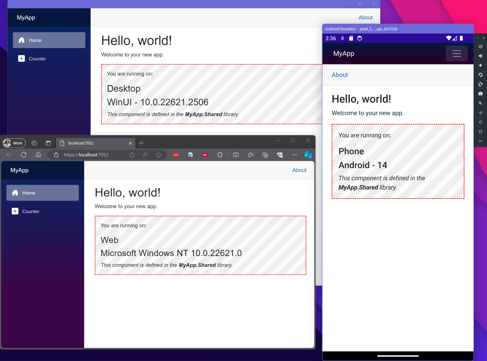
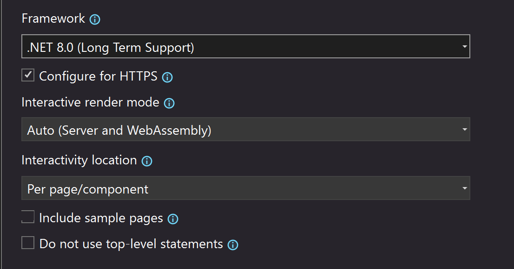

# Setting up a solution for MAUI hybrid and Blazor web with shared UI
## (Rendering mode: Server - Global)
This repo demonstrates a starter solution that contains a MAUI hybrid (native, cross-platform) app, a Blazor web app and a Razor class library that contains all the shared UI that is used by both native and web apps. 



It also demonstrates how to use Blazor render modes on the web app but ignore them in the MAUI app. It does this by setting up a helper class in the RCL called `InteractiveRenderSettings` that has properties that are used as render mode in the components while running in the web app. The `MauiProgram.cs` sets these properties to `null` so they are ignored on the client instead of throwing an exception.

## Manually setting up the solution

To manually set this up yourself in Visual Studio, follow these steps

1.  Create an empty Solution and name it `MyApp`

2.  Add new project MAUI Blazor Hybrid app and name it `MyApp.MAUI`

3.  Add new project Blazor Web App and name it `MyApp.Web`. Select the following options:    

    a.  Authentication type = none

    b.  Configure for HTTPS is checked

    c.  Interactive render mode = **Server**

    d.  Interactivity location = **Global** <-- _This setting is important because hybrid apps always run interactive and will throw errors on pages or components that explicitly specify a render mode. See [#51235](https://github.com/dotnet/aspnetcore/issues/51235). If you do not use a global render mode, you will need to implement the pattern shown in this repository._
    
    e.  Uncheck Include sample pages
       
      

4.  Add new project Razor Class Library (RCL) and name it `MyApp.Shared`

    a.  don\'t select \"support pages and views\" (default)

5.  Now add project references to `MyApp.Shared` from both `MyApp.MAUI` & `MyApp.Web` project

6.  Move the `Components` folder and all of its contents from `MyApp.MAUI` to `MyApp.Shared` (Ctrl+X, Ctrl+V)

7.  Move `wwwroot/css` folder and all of its contents from from `MyApp.MAUI` to `MyApp.Shared` (Ctrl+X, Ctrl+V)

8. Rename the last two `@using`s in the `_Imports.razor` (which was moved from `MyApp.MAUI` to `MyApp.Shared` as a part of `Components` folder) to `MyApp.Shared`

```code
...
@using MyApp.Shared
@using MyApp.Shared.Components
```
9. Open the `_Imports.razor` in `MyApp.Web` add a `@using` to `MyApp.Shared`

```code
...
@using MyApp.Shared
```

10.  Open the `Routes.razor` file (which was moved from the `MyApp.MAUI` to `MyApp.Shared` a part of `Components` folder) and change `MauiProgram` to `Routes`:
```
<Router AppAssembly="@typeof(Routes).Assembly">
...
```
11. Open the `MainPage.xaml` in the `MyApp.MAUI` project and add a `xmlns:shared` reference to the
    `MyApp.Shared` RCL and update the `BlazorWebView` `RootComponent` `ComponentType` from `local` to `shared`:
```xml
<?xml version="1.0" encoding="utf-8" ?>
<ContentPage xmlns="http://schemas.microsoft.com/dotnet/2021/maui"
             xmlns:x="http://schemas.microsoft.com/winfx/2009/xaml"
             xmlns:local="clr-namespace:MyApp.MAUI"
             xmlns:shared="clr-namespace:MyApp.Shared;assembly=MyApp.Shared" 
             x:Class="MyApp.MAUI.MainPage"
             BackgroundColor="{DynamicResource PageBackgroundColor}">

    <BlazorWebView x:Name="blazorWebView" HostPage="wwwroot/index.html">
        <BlazorWebView.RootComponents>
            <RootComponent Selector="#app" ComponentType="{x:Type shared:Routes}" />
        </BlazorWebView.RootComponents>
    </BlazorWebView>
</ContentPage>
```

12. In the `MyApp.MAUI` project open `wwwroot/index.html` and change stylesheets to point to
    `_content/MyApp.Shared/`:

```xml
<link rel="stylesheet" href="_content/MyApp.Shared/css/bootstrap/bootstrap.min.css" />
<link rel="stylesheet" href="_content/MyApp.Shared/css/app.css" />
```

13. Open `App.razor` from `MyApp.Web` project `Components` folder and **add** the stylesheet references to
    the `MyApp.Shared` there too:

```xml
<link rel="stylesheet" href="_content/MyApp.Shared/css/bootstrap/bootstrap.min.css" />
<link rel="stylesheet" href="_content/MyApp.Shared/css/app.css" />   
```
14.  In the `MyApp.Web` project, delete files `Routes.razor`, `Layouts` folder & all its contents, and `Pages\Home.razor` (leave the `Error.razor` page)

15. Open `MyApp.Web` project `Program.cs` file and `AddAddionalAssemblies` to `MapRazorComponents`:

```code
app.MapRazorComponents<App>()
    .AddInteractiveServerRenderMode()
    .AddAdditionalAssemblies(typeof(MyApp.Shared._Imports).Assembly);
```
**You should now be all set! F5 and party on.**


## Using Interfaces to support different device implementations

This sample also shows how to use interfaces on the UI to call into different implementations across the web app and the native (MAUI Hybrid) app. We will make a component that displays the device form factor. We can use the MAUI abstraction layer for all the native apps but we will need to provide our own implementation for the web app.

1.  In the `MyApp.Shared` project, create an `Interfaces` folder and add file called `IFormFactor.cs` with the following code:

```csharp
namespace MyApp.Shared.Interfaces
{
    public interface IFormFactor
    {
        public string GetFormFactor();
        public string GetPlatform();
    }
}
```

2.  Move `Component1.razor` in the `MyApp.Shared` project to `Components` folder and add the following code:

```razor
@using MyApp.Shared.Interfaces
@inject IFormFactor FormFactor

<div class="my-component">
    <p>You are running on:</p>

    <h3>@factor</h3>
    <h3>@platform</h3>

    <em>This component is defined in the <strong>MyApp.Shared</strong> library.</em>
</div>

@code {
    private string factor => FormFactor.GetFormFactor();
    private string platform => FormFactor.GetPlatform();
}
```
3. Now that we have the interface defined we need to provide implementations in the web and native apps. In the `MyApp.Web` project, add a folder called `Services` and add a file called `FormFactor.cs`. Add the following code:

```csharp
using MyApp.Shared.Interfaces;

namespace MyApp.Web.Services
{
    public class FormFactor : IFormFactor
    {
        public string GetFormFactor()
        {
            return "Web";
        }
        public string GetPlatform()
        {
            return Environment.OSVersion.ToString();
        }
    }
}
``` 
4. Now in the `MyApp.MAUI` project, add a folder called `Services` and add a file called `FormFactor.cs`. We can use the MAUI abstractions layer to write code that will work on all the native device platforms. Add the following code:
 
```csharp
using MyApp.Shared.Interfaces;

namespace MyApp.MAUI.Services
{
    public class FormFactor : IFormFactor
    {
        public string GetFormFactor()
        {
            return DeviceInfo.Idiom.ToString();
        }
        public string GetPlatform()
        {
            return DeviceInfo.Platform.ToString() + " - " + DeviceInfo.VersionString;
        }
    }
}
```
5. Use dependency injection to get the implementations of these services into the right place. In the `MyApp.MAUI` project open `MauiProgram.cs` and add the `using`s at the top:
```csharp
using Microsoft.Extensions.Logging;
using MyApp.MAUI.Services;
using MyApp.Shared.Interfaces;
```
6. And right before the call to `builder.Build();` add the following code:

```csharp
...
// Add device specific services used by Razor Class Library (MyApp.Shared)
builder.Services.AddSingleton<IFormFactor, FormFactor>();

return builder.Build();
```
7. Similarly, in the `MyApp.Web` project, open the `Program.cs` and right before the call to `builder.Build();` add the `using`s at the top:
```csharp
using MyApp.Web.Components;
using MyApp.Shared.Interfaces;
using MyApp.Web.Services;  
```
8. And right before the call to `builder.Build();` add the following code:
```csharp
...
// Add device specific services used by Razor Class Library (MyApp.Shared)
builder.Services.AddScoped<IFormFactor, FormFactor>();

var app = builder.Build();
```

You can also use compiler preprocessor directives in your RCL to implement different UI depending on the device you are running on. In that case you need to multi-target your RCL like you do in your MAUI app. For an example of that see: [BethMassi/BethTimeUntil](https://github.com/BethMassi/BethTimeUntil) repo. 

**That's it! Have fun.**
